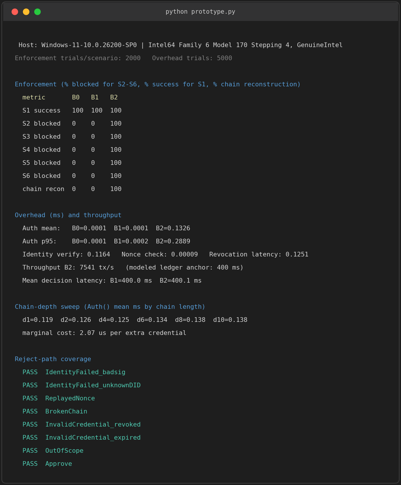
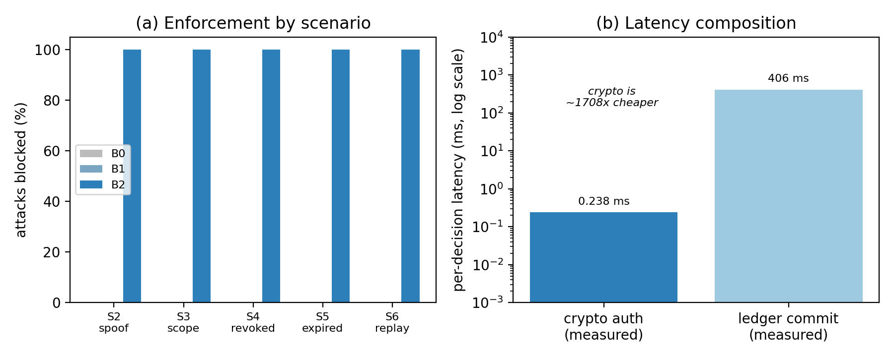

# Verifiable Identity and Delegation for Orchestrated Multi-Agent AI Systems
### A Blockchain-Anchored Framework

Most multi-agent AI platforms identify an agent by nothing more than **its name on an allow-list** — which can only answer "is this name known?" It cannot prove who actually acted, who authorized them, or whether the action stayed within the authority it was given.

This framework closes that gap. Each agent gets a **cryptographic identity** (a DID bound to an Ed25519 key pair). Every orchestrator → specialist hand-off becomes a **signed, scoped, time-bounded, revocable delegation credential** anchored on a permissioned ledger (Hyperledger Fabric). Every consequential action is **authorized on-chain — its full authority chain verified — before it runs**, and reconstructable after it for audit.

## What it enforces

Before any high-impact action runs, an on-chain `Auth()` check runs six tests, in order. **All must pass:**

| # | Check | Question it answers |
|---|-------|---------------------|
| 1 | **Identity** | Does the signature verify against the agent's registered key? (not an impostor) |
| 2 | **Freshness** | Is the action's nonce unused? (not a replay) |
| 3 | **Chain** | Does the authority chain reach a trusted root? |
| 4 | **Scope** | Is the action within the delegated scope? (scope only ever narrows) |
| 5 | **Validity** | Is every credential within its time window? |
| 6 | **Revocation** | Is nothing in the chain revoked? |

## Repository structure

```
prototype/   Self-contained Python reference implementation of the authorization
             layer (identities, signed delegation chains, replay protection, the
             six-check Auth() predicate) + measured results.
fabric/      Hyperledger Fabric chaincode — the three smart contracts
             (IdentityRegistry, DelegationRegistry, RevocationPolicy) — plus an
             end-to-end latency/throughput benchmark.
```

## Quick start (prototype)

```bash
pip install -r prototype/requirements.txt
python prototype/prototype.py
```

This runs 2,000 enforcement trials per scenario and 5,000 overhead trials, writes `results.json` and `results_fig.png`, and self-tests every rejection path (it exits non-zero if any misbehaves, so the run doubles as the test suite).

### Output



Three configurations are compared — **B0** (no checks), **B1** (allow-list, i.e. prior work), **B2** (this framework) — over six scenarios: S1 legitimate, S2 spoof, S3 out-of-scope, S4 revoked, S5 expired, S6 replay.

- **B2 blocks 100% of every attack (S2–S6)** while letting every legitimate action through, and **reconstructs 100% of authority chains**. B0 and B1 block **0%** — a name-on-a-list has no signatures, scope, validity windows, revocation, or freshness check, so it cannot detect these attacks at all.
- The full `Auth()` check costs about **0.24 ms**, and **all 8 reject paths** are verified reachable.

## Results



Two cost components, each **measured** separately:

| Component | Measured |
|-----------|----------|
| Cryptographic authorization (this framework's addition) | **0.238 ms** mean (0.409 ms p95) |
| Ledger commit on a real Hyperledger Fabric 2.5 network | **~406 ms** mean (509 ms p95), 250 ms orderer batch interval |

The cryptography is **~1,700× cheaper** than the ledger step it rides on. In other words, adding real cryptographic identity and scoped, revocable delegation is effectively free relative to the blockchain cost that *any* on-chain governance already pays — the bottleneck is the ledger, not the authorization.

## Fabric network

The three contracts deploy on the `fabric-samples` test-network. Because the legacy peer-side chaincode build is incompatible with Docker Engine 29.x, deploy as a **Chaincode-as-a-Service** (using `fabric/chaincode/Dockerfile`), then run the benchmark:

```bash
cd fabric/chaincode && npm install && npm run build && cd ..
# bring up the test-network and deploy CCAAS (see fabric/network/deploy.sh)
cd bench && npm install && node bench.js   # writes fabric_results.json
```

## The three-layer correspondence

The same six-check `Auth()` logic lives in three places, kept byte-for-byte in lockstep:

- **`prototype/prototype.py`** — `B2Authorizer.decide()`
- **`fabric/chaincode/src/revocationPolicy.ts`** — `authorizeAction()`
- the framework's formal `Auth()` predicate and authorization algorithm.

Change the check order, the reject reasons, the scope-intersection rule, or the canonical serialization in one, and you change all three.

---

Reference implementation for the paper *"Verifiable Identity and Delegation for Orchestrated Multi-Agent AI Systems: A Blockchain-Anchored Framework"* (P Anand Kumar, Chennai Institute of Technology).
